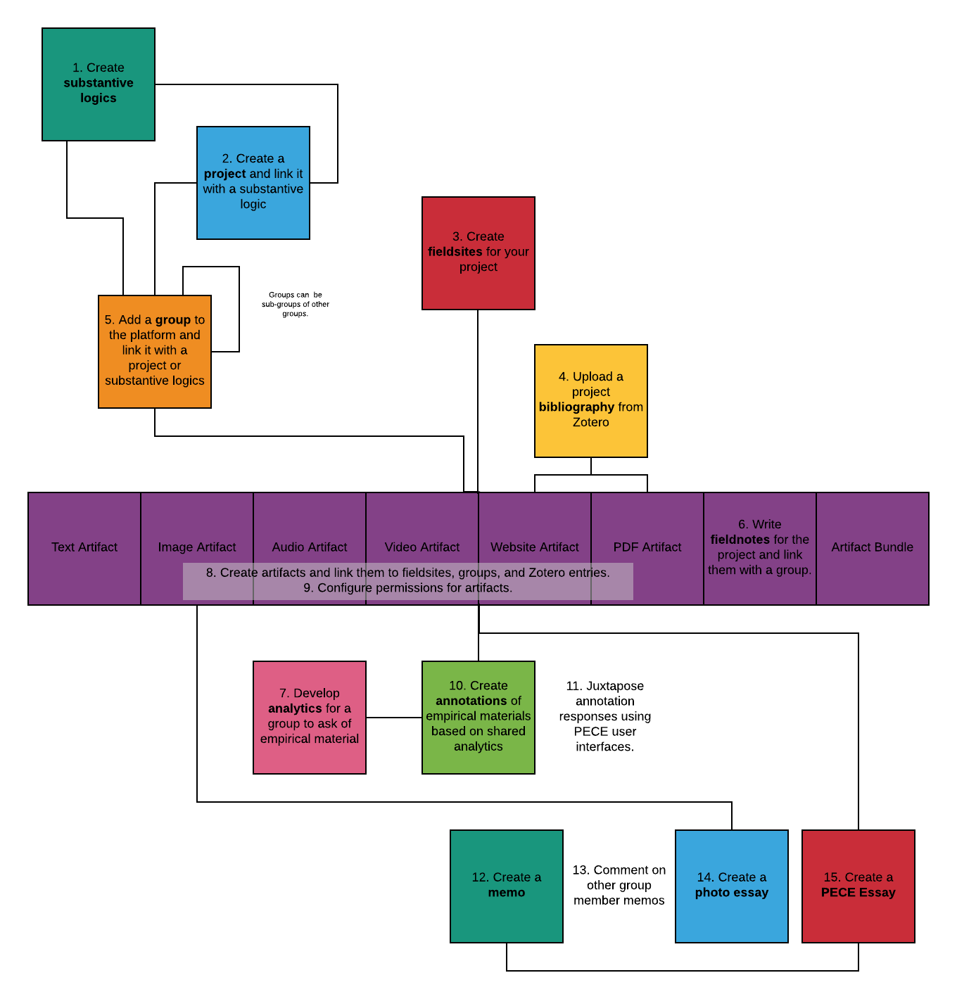
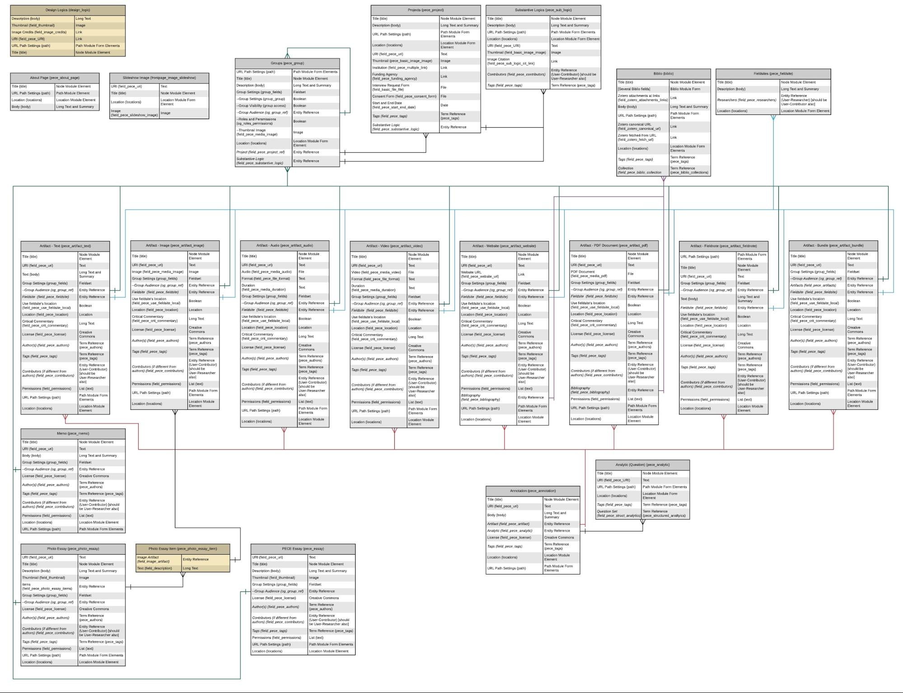
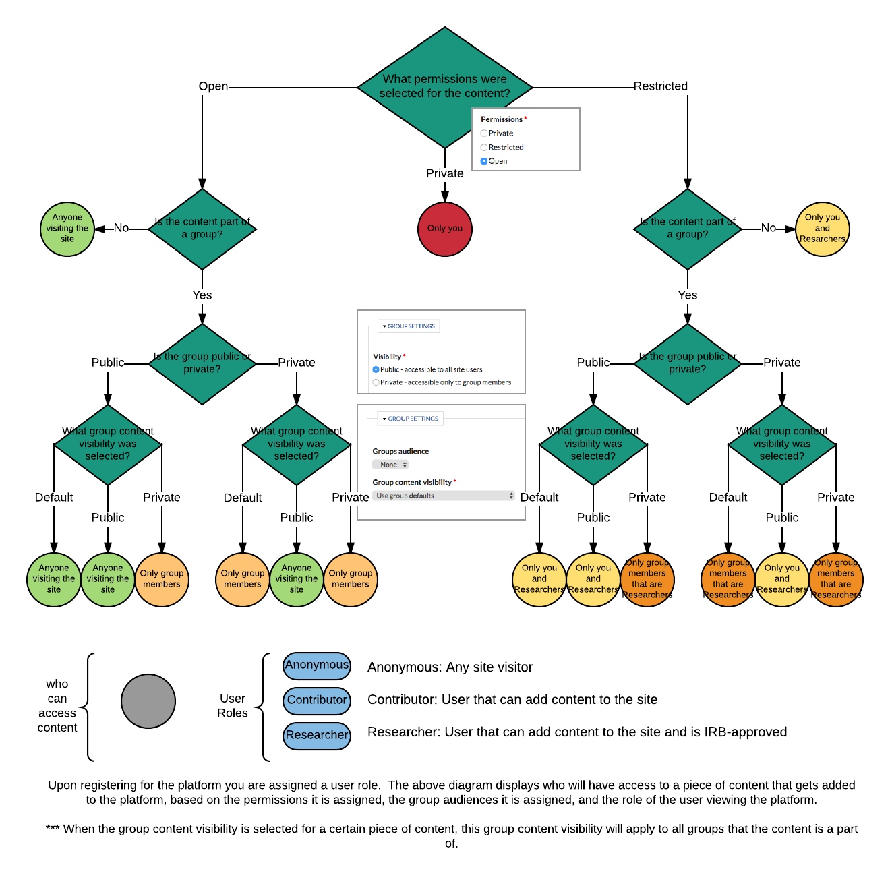

PECE Development
================

Background
----------

The development of PECE as a stand-alone platform began in 2011. Since
then, the PECE design team has gone through several iterations of the
platform. In 2013, we began development of PECE on the content
management system Plone; however due to the technical and
epistemological challenges that the system posed, we moved to the
content management system Drupal in 2014. The first attempt to design
PECE with Drupal involved configuring factory standard Drupal features
and add-on modules, using administrative menus offered *through-the-Web*. Using the Features module, we were able to
standardize certain configurations on one instance and then push them
out to other instances of the platform. However, in order to package
PECE into a distribution that could be downloaded and used by any
ethnographic project, we realized that we would need to hire developers
to formalize our configurations, secure our permissions system, and
develop new software modules.

In 2015, we hired the Brazil-based Drupal development company Taller to
begin developing PECE as a Github distribution. Since 2015, we have
formalized a data model, a permissions system, a workflow, and several
user interfaces. The first version of the distribution was released in
March 2016, and since then we have released 3 updates to the
distribution, each offering additional features and improved user
interfaces. We also hired the development company Agaric to work on
specific modules for PECE in the fall of 2015. Agaric took over
development of a module to integrate Zotero feeds with Drupal platforms
and developed a module to integrate Archival Resource Keys in Drupal
platforms. Both of these modules are available through the Drupal site
at
[*https://www.drupal.org/platform-for-experimental-collaborative-ethnography*](https://www.drupal.org/platform-for-experimental-collaborative-ethnography).
The Zotero module has been configured and is available in the PECE
distribution and the ARK module should be available through PECE
shortly. Today, we have one lead developer, Renato Vasconcellos Gomes,
working full-time to add new features to the platform.

What’s the difference between the development repository, the distribution, and an instance of PECE?
----------------------------------------------------------------------------------------------------

When new functionality is created for PECE, it does not immediately get
updated in the site that you are using. Once new code is developed and
tested for PECE, it is pushed to a [**development repository**](https://github.com/revagomes/drupal-pece) on Github. The PECE Tech Team then packages this code up into a more stable version of the development repository for distribution. You will hear us refer to this as the [**PECE distribution**](https://github.com/PECE-project/pece-distro), or PECE distro. Any set of researchers can download this distribution onto their server in order to run an *instance* of PECE. [**STS Infrastructures**](http://stsinfrastructures.org), [**The Asthma Files**](http://theasthmafiles.org/) and the [**Disaster-STS-Network**](http://disaster-sts-network.org/) are instances of the PECE distro. Whenever new code is packaged into the distro, existing instances of PECE need to be updated in order for the new code to be integrated.

Current Development Process
---------------------------

There are several steps that we must move through in order to make
changes in the platform. First, we must have funding available to pay
our developers and a proposal that’s been approved through the
university to work with them. We have a very long list of features that
we would like added to the platform, as well as a long list of bugs that
we would like fixed, so second we need to prioritize the change within
this list. Once we begin working on a change, it must go through phases
of development, testing, and approval to be added to the Github
development repository. Once the change is in the development
repository, it has to be packaged into the PECE distribution, and once
packaged into the PECE distribution, each instance of PECE needs to be
updated in order for the change to appear. Each of these steps involves
coordinating different stakeholders (many of whom are involved in many
other projects and most of whom are volunteering time to work on PECE)
and overcoming bureaucratic barriers. This means that requests for
changes could take several weeks or even months. **We would really like for PECE to be a resource that researchers find useful; however, we ask that you be patient with us when requesting fixes and new features.**

### How to report a bug or request a feature

If you do notice a bug in the platform, or if there is a feature that
you really believe would support your work, we ask that you follow the
following steps:

1.  Check our [*GitHub issue*](https://github.com/PECE-project/pece-distro/issues) page to see if someone else has reported the bug or requested the feature.

2.  Search this document to see if your question has been answered within it.

3.  If you’ve gone through steps 1 and 2 and still don’t see your issue listed, please navigate to [*the following form*](https://platform-for-experimental-collaborative-ethnography.forms.fm/issues/forms/5287) for reporting your concern. Once you submit the form, an issue will be created on our [*GitHub issue*](https://github.com/PECE-project/pece-distro/issues) page. You can monitor this page to see who has been assigned to your issue and to track progress on addressing it.

We sometimes get several emails a day pointing out bugs or requesting
fixes in the platform. Following these steps will ensure that we don’t
lose your request and that we can prioritize them appropriately. It will
also dramatically speed up the time that we can get up to speed on the
issue, as many of our follow-up questions will be answered through the
form.

Introduction to PECE
=====================

Data Model
----------

### Data Type Glossary

-   Substantive Logic: Substantive logics document the rationale for running a particular instance of PECE or for conducting a particular research project. They can be associated with Projects or Groups.

-   Project: A project designates a research project that the platform is being used to scaffold. You can use this content type to describe when a project starts and ends, its institutional affiliation, and its funding source.

-   Fieldsite: A fieldsite is a reference to a certain geographic location where research will be conducted. You can link artifacts to fieldsites to document where the artifact was found.

-   Group: Groups are workspaces where several individuals can contribute content, share a field diary, write collaboratively, and publish essays.

-   Artifact: An artifact is the basic unit of data on PECE. Artifacts represent materials that an ethnographer determines to be data relevant to the site; this can include documents, images, audio, videos, and web sites, which could include field notes, interviews, news articles, journal articles, films, etc.

-   Artifact bundle: An artifact bundle is an artifact of artifacts. You can create an artifact bundle to annotate a group of artifacts together.

-   Analytic: An analytic is a question designed to elicit various viewpoints about the artifact. Questions can be categorized into Structured Analytics (named sets of questions).

-   Annotation: Annotating an artifact involves responding to a set of shared and evolving questions that are designed to elicit various viewpoints about the artifact. In the vocabulary of literature (the humanities field most akin to our tradition of anthropology), you can think of annotating an artifact as “reading” an artifact. Each reading, performed by different individuals, produces different interpretive insights that broaden and deepen the collaborative analysis of an artifact.

-   Memo: A memo is a first draft of a piece of writing that may be published on the site. Upon publishing a memo, that memo is opened for comments from the platform’s community.

-   Photo Essay: a collection of image artifacts, ordered into a slideshow, with text added for context.

-   PECE Essay: a collection of artifacts, memos, and essays, organized into a collage, with text added for context

### PECE in 15 Steps: A Typical Workflow

1.  Outline the rationale for your project by [*creating substantive logics*](../usersguide#what-is-a-substantive-logic) in the platform and associating them with the project.

2.  [*Formalize a project*](../usersguide#what-is-a-project) by adding its metadata to the platform.

3.  Outline fieldsites for your project by [*creating fieldsites*](../usersguide#what-is-a-fieldsite) in the platform.

4.  [*Upload a project bibliography*](../usersguide#how-do-i-add-a-zotero-feed-to-the-platform) from Zotero.

5.  [*Create a group*](../usersguide#what-is-a-group) where you can share empirical materials related to the project.

6.  [*Write field notes*](../usersguide#what-is-the-difference-between-a-text-artifact-and-a-field-note) and share them in the group space.

7.  [*Develop shared questions*](../usersguide#how-do-i-create-a-structured-analytic) for the group to ask of empirical materials.

8.  Archive empirical materials by [*creating artifacts*](../usersguide#how-do-i-add-content) and [*adding them into your group space*](../usersguide#how-do-i-add-content-ive-created-to-a-group).

9.  [*Configure permissions*](#permissions) for artifacts you’ve added to the platform.

10. [*Annotate empirical materials*](../usersguide#how-do-i-annotate-an-artifact) with shared questions.

11. [*Juxtapose*](../usersguide#how-do-i-see-how-others-annotated-an-artifact) annotation responses through PECE user interfaces.

12. [*Write a memo*](../usersguide#how-do-i-create-a-memo) to begin synthesizing what you’ve learned from analysis.

13. Comment on other group member memos.

14. [*Create a photo essay*](../usersguide#how-do-i-create-a-photo-essay) with images collected during the project.

15. [*Create a PECE essay*](../usersguide#how-do-i-create-a-pece-essay), collaging artifacts with analysis and free text.

### Data Model Overview

Each box in the following workflow represents a node or content type in
the platform and each line illustrates how different nodes are or can be
linked.

### Detailed Data Model

Permissions
-----------

### User roles

There are three user roles in the system, which the site administrator
distributes when users request an account on the platform.

**Anonymous users** can visit the site and can see any content that has
been designated as public.

**Contributors** can log-in to the site, manage a profile, join groups,
and contribute content to the site. They have access to content that has
been designated as public or their own content that they’ve designated
as private.

**Researchers** are typically those individuals on a project that have
been IRB-approved to view collaborative research materials. Researchers
have all of the same capabilities as a contributor, except that they can
also view content that has been designated as Restricted.

### Content Permissions

There are three permissions which can be applied to content that is
created on the platform. Designating content permissions determines
which site visitors and users will be able to view content.

Content designated as **Open** can be seen by any of the platform’s site
visitors unless the content has been given special [*group content restrictions*](#group-content-permissions).

Content designated as **Restricted** can be seen only by the platform
users that have been designated as Researchers (See [*User Roles*](#user-roles)).

Content designated as **Private** can only be seen by the content’s
creator.

### Group permissions

Any group that is created on the platform can either be public or
private. These permissions are selected when [*creating a group*](../usersguide#how-do-i-create-a-group).

**Public** groups will be accessible by any platform visitor.
Additionally, all content associated with a public group will be public
to the platform by default.

**Private** groups will be accessible only to group members. When not
logged-in, private groups will not be listed anywhere on the platform
and cannot be searched for. All content associated with a private group
will be private to the group members by default.

Group content permission settings can be overridden using the [*group content visibility*](#group-content-permissions) setting when creating content on
the platform.

### Group content permissions

When creating a piece of content, you can use the group content
permissions field to override the [*group’s default content permissions*](#group-permissions). This means that you can designate
content that has been associated with a private group as “public” or
content that has been associated with a public group as “private.”

### Overview - Who will see my content?

PECE Wishlist
-------------

### Groups

-   Groups will be able to maintain a group bibliography.

-   Groups will have a forum space where they can facilitate group discussions.

### Artifacts

-   Users can create an artifact that embeds content or widgets stored elsewhere through an iFrame. This will allow embedding YouTube videos, Google Calendars, and other cool things.

-   All fieldnotes on the site will have a title based on the user that created it and the date it was created.

### Annotations and Analytics

-   On annotation pages, users will be able to filter the annotations according to how they’ve been tagged.

### Memos, Essays, and Other Visualizations

-   The memo page will be redesigned so that groups can be linked from them.

-   Users will be able to create timelines.

-   On the PECE Essay the card view will allow users to display PDFs rather than just icons linking to PDFs.

### User experience/interface

-   All of the icons on the site will be clickable, along with the links that they are attached to.

-   Similar tags or misspelled tags on the site will be merged automatically.

### Data Management

-   All content on the site can be assigned a unique Archival Resource Key.

-   The site will require that all artifacts be uniquely named.

-   There will be options to add metadata about a collaborative project’s agreed upon techniques and equipment.

### Discovery

-   We are working to enhance capacity to search across multiple instances of PECE.

### Site Administration

-   We hope to eventually create options where user data that has been licensed with a Creative Commons license can be maintained, while All Rights Reserved data can be deleted with the user.

-   The admin role will be configured with additional options.

Known Bugs
----------

### Groups

-   When you click the “Request Group Membership” button in a certain group, the box changes to “Unsubscribe from Group” even before the group’s administrator approves your membership. You will not be able to add to the group, and it will not display on your Dashboard until the administrator approves your membership. Soon this button will display “Group Membership Pending” in the interim.

-   Only 5 group members display under the “Members” heading of the group page. Soon all group members will display with the Owner of the group listed at the top.

### Annotations and Analytics

-   On the Annotated Artifacts tab of user’s dashboard, links to annotations display rather than links to artifacts that the user has annotated.
