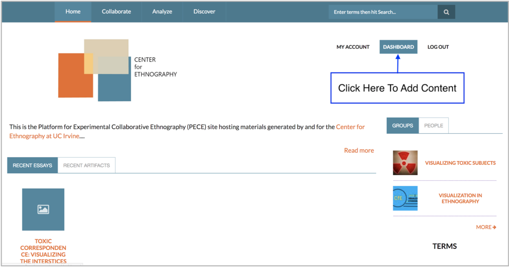
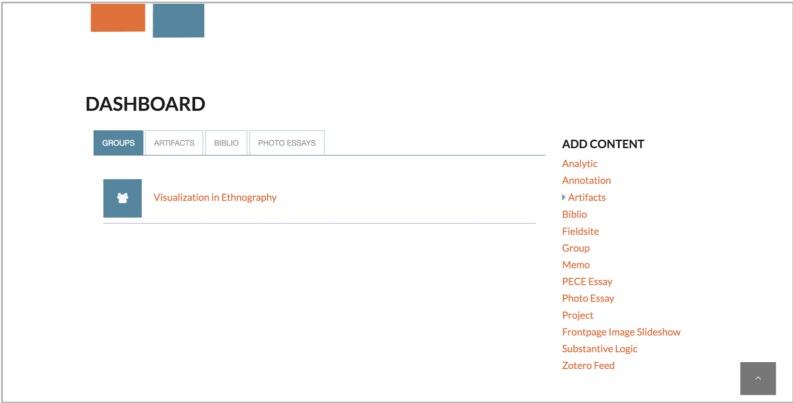
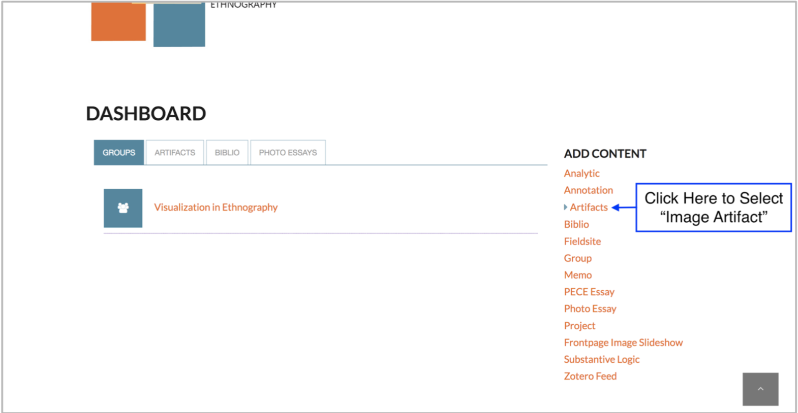
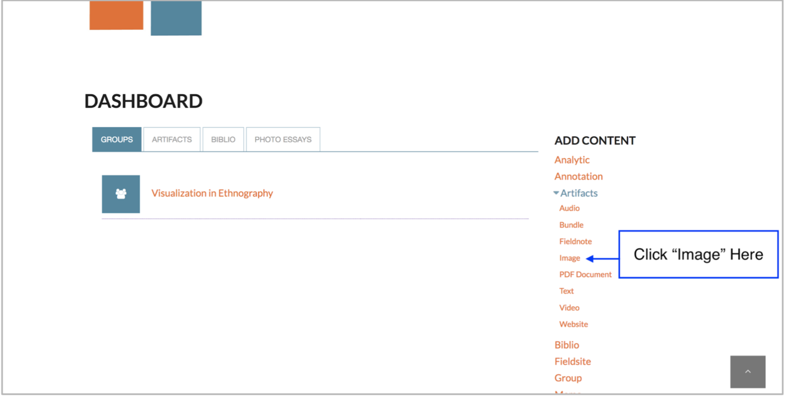
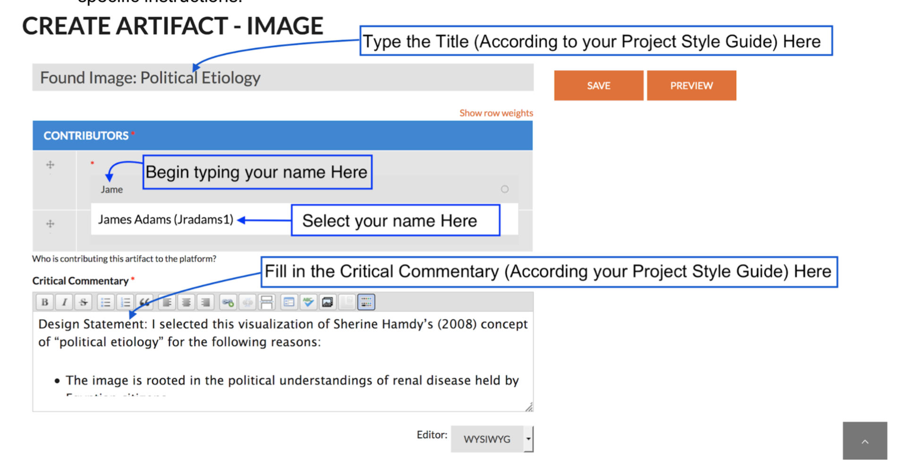
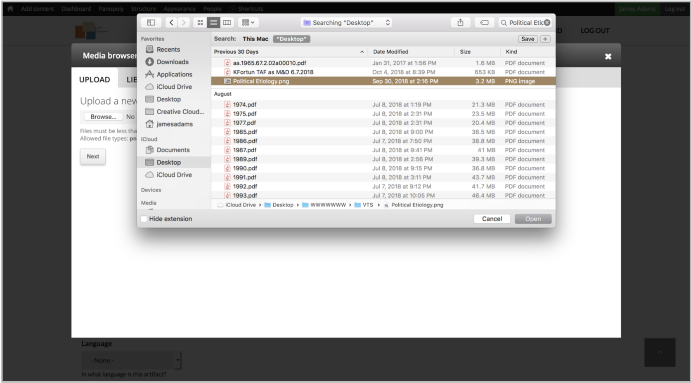
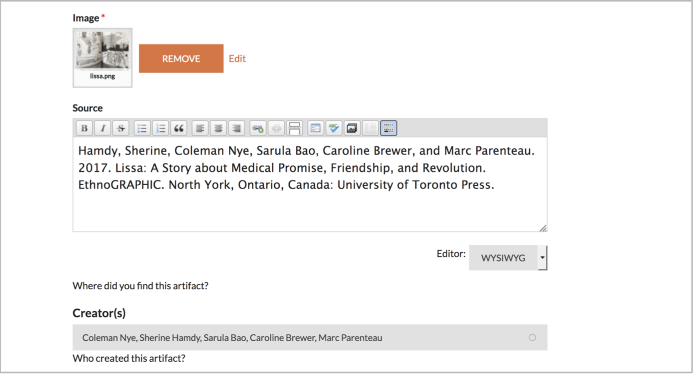
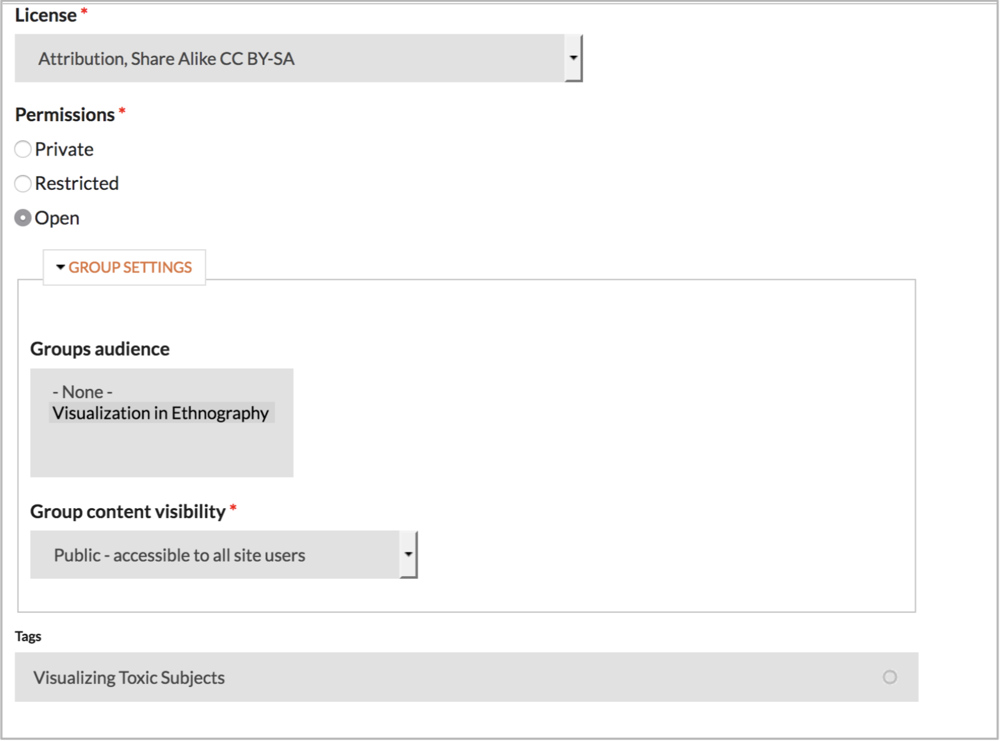
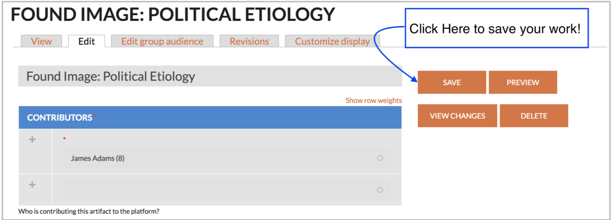

Artifacts
=====================

Steps to Create an Artifact
---------------------------------------
1. The process of adding any variety of content to PECE begins by logging in with your screen name and password and clicking “DASHBOARD” in the top right corner.

    

2. You should now see your Dashboard page.

    

    Across the top of the page, in the different tabs you can find the groups to which you currently belong, along with any artifacts or essays that you have created. Along the right side of the page, you will find a list of options for creating different forms of new content. “Artifacts” are one type of content. An artifact is the basic working unit of PECE; once, created, artifacts are then used in photo essays (for image artifacts only), timelines, or PECE Essays (both of which accept images, video, documents, and any other type of artifact)

3. You can add many types of artifacts, including audio files, video, images, pdf, text, and websites. Click the “Artifacts” drop-down menu (the third option in the “Add Content” column) to see the list of options.

    

    Next, click the type of artifact you want to create.

    

4. You should now have access to all of the fields you need to fill out in order to create a new image artifact. First, type the title of your image in the “Title” pane.

5. Add yourself as a contributor by typing the first few letters of your name into the
“contributor” field. Your screen name should pop up. Select your name. Repeat this process with the names of any other project members who you would
like to grant access to editing the artifact.

6. Next, write out your “Critical Commentary” section, making sure to follow any project-
specific instructions.

    

7. Next, upload your artifact by clicking the “Browse” link.

    

    The browser window should pop up. Click “Browse” and select the name of the file you would like to upload.

    

    * Click “Open” and then “Next” to upload the file into PECE. Depending on the size of the file it may take a few seconds or minutes to upload; a small icon for the file will appear once uploading is complete.
    * Add Alt Text and Title Text as desired.
    * Click Save.

8. Next, cite the source of the artifact in the Source pane, using your platform's preferred citation format.

9. In the “creators” pane, credit all the contributors who helped produce the image.

    

10. You may also include the format, language, or fieldsite associated with the image if you feel as though they are important or interesting to the meaning or usefulness of the image. Otherwise you may choose to leave them blank.

11. For the license, we encourage you to leave it as Attribution, Share Alike CC BY-SA, but you can choose any of the other Creative Commons license as you see fit. Please refer
to the [*Licensing*](../licensing) section for more information.

12.  If the image is not ready to be made public, you can alter the permissions of the image. Selecting “Private” limits visibility to you and you alone. Selecting “Restricted” limits visibility to users of PECE designated as “Researchers” (this mostly matters to instances of PECE subject to IRB
protections). Selecting “Open” make the artifact visible to all internet users. For more information, see [*Content Permissions*](../permissions#content-permissions) section.

13. To designate the content as part of a group, select the group's name in the Group Audience field. Select “Public” to make it accessible to all viewers; this is the setting we generally recommend. Select “Private” to limit visibility to Group Members.

14. Tag the content. As you type, suggested tags will be automatically generated if they exist already in the system. We recommend following theses suggestions and using existing tags if they are not too different from what you were intending, but feel free to make up new tags!

    

15. Only add an expiration date if it is important for the artifact to be deleted from the platform at some point.

16. Finally, scroll back up to the top of the page and click “Save” to save your work. And remember: all of these settings can be revised at time: private artifacts can be made public later, and vice versa, for example.

    

Frequently Asked Questions
---------------------------------------

### What is the difference between a text artifact and a field note?

A text artifact and a fieldnote are technically very similar. However,
unlike a text artifact, a fieldnote will not have a title; the date the
fieldnote was created will become the title. Also a fieldnote will
appear in the field diary on user’s dashboard. If associated with a
group, a fieldnote will also appear under the Field Diary tab of the
group’s page, ordered by the date created.

### What is an artifact bundle, and why would I use it?

An artifact bundle is an artifact that links to several other existing
artifacts. You can create an artifact bundle so that you may annotate a
group of artifacts together.

### What is “critical commentary”?

In this field, you should provide commentary on the artifact that documents its significance as an ethnographic objects and why it is relevant to the platform. See sections on the
[*Source field*](#what-does-source-mean), and [*Licensing*](#licensing) for more information about
attribution of artifacts.

### How do I select a file that has already been added to the system?

When creating a piece of content, under the Image Upload field, click
the ‘Browse’ button to select a file from the existing PECE library.
Select the ‘Library’ tab. Choose a file and hit the ‘Submit’ button.

### How do I list the creator (author, photographer, composer) of a piece of content when they are not part of the system?

When creating an artifact, the Creator field can be used to designate
the author of a piece of content when that creator is not a user of the
system. Technically, this field is a tag. This means that if content in
the system has already been tagged with the creator, you should be given
the option to select this creator’s name when you begin typing in this
field. Otherwise, upon saving the artifact, the creator’s name will
become a new “Creator tag” in the system.

### How do I add a fieldsite to an artifact?

First the fieldsite needs to have already been added to the platform.
See [*How do I add a fieldsite*](#what-is-a-fieldsite)? for instructions on
how to do this.

### When I edit content, what should I include in the revision log message?

If a researcher cites a piece of content on the platform on a particular
date, and then the content creator revises the content on a later date,
it is important to be able to track which version of the PECE content
the researcher was citing. PECE enables users to track changes made to
content over time. In the revision log message section, users should
summarize changes they make the content, so that it is easier to track
the changes. See [*Where can I access older versions of content?*](#where-can-i-access-older-versions-of-content) for where to
track these changes.

### Where can I access older versions of content?

When logged in, navigate to the content. Click on the ‘Revisions’ tab.
If there is no ‘Revisions’ tab, it means that no changes have been made
to the content. Under the ‘Revisions’ tab, you can click on a date -
time under the Revisions column to access older versions of the content.
You can also compare a newer version of content to an older version by
selecting two versions under the Compare column and clicking the
‘Compare’ button.

### I’ve identified my content as having multiple contributors, but those contributors don’t have access to edit the content. What’s going on?

Identifying contributors only credits those site users involved in
contributing the content. It does not grant those users access to edit
the content. Only the content creator can edit the content.

### Where can I find my fieldnotes?

Navigate to your ‘Dashboard’. This link will be in the main menu. On
your dashboard, there will be a tab labeled ‘Field Diary’. Click on this
tab to access your fieldnotes. They will be ordered chronologically.

### Why do my published images appear blurry?

Currently, when images are uploaded to PECE, the files are compressed,
and the image quality downgrades. If this is a problem for your content,
you should reach out to your site administrator and ask to have the
quality upgraded.

### Can I download files from the platform?

You cannot download files that are listed as All Rights Reserved. Please
see the [*Licensing*](../licensing) section for more information about
this. Audio files and video files that have been added as a part of Open
artifacts can be downloaded from the platform. Navigate to the artifact
page where the file is displayed. In the bottom right hand corner of the
rendered file, there will be an upside down arrow. Click this button to
download the file.

### 

PDF files that have been added as part of Open artifacts can also be
downloaded from the platform. Navigate to the artifact page where the
file is displayed. When you hover over the PDF viewer, a bar will
display at the top. In the upper right hand corner of this bar, there
will be an upside down arrow. Click this button to download the file.

Right now, there is not a simple way to download image files. You can
right click on the image and Save the file to your computer however.

### Can I add a Youtube or Vimeo video to the platform?

Currently, you cannot embed a YouTube for Vimeo video in the platform.

### Can I add a map to the platform?

Currently the only way to share a map on the platform is by capturing an
image of it and uploading it to the site as an image artifact, or
alternatively by uploading a link to the map as a Website artifact.
